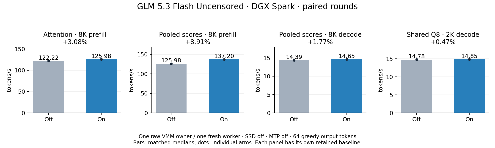

# GLM-5.3 Flash Uncensored on DGX Spark

Development evidence, 2026-10-07, base commit `15ca821e`, retained arithmetic
`15523923`, bank-load repair `e6808ea2`. This record covers
[Baekpica's mixed artifact](https://huggingface.co/Baekpica/GLM-5.3-Flash-Uncensored-Mixed-Quant-GGUF).
The [earlier antirez Q2 gate](ds4-dfm-model-families.md#glm-53-flash-release-scope)
qualifies its own artifact and recorded runtime.
The [2026-10-08 Prefill campaign](glm53-prefill-2026-10-08.md) records the newer
2048-row path and SSD policy. Its gates do not extend this record's 1M scope.

## Artifacts and input

Download revision: `597f15ced1876cbebd7224b359abe77571c79c7c`.

| File | Bytes | SHA256 |
|---|---:|---|
| `GLM-5.3-Flash-Uncensored-Mixed-IQ2XXS-IQ2XS-Q2K.gguf` | 93,920,031,264 | `7f6f96df758b5d651561c2f06ffdd0d1075a24f10654320e24e7d66c48db6017` |
| `GLM-5.3-Flash-Uncensored-BF16-Vision.gguf` | 1,127,280,960 | `e7f71610840eb4df88164ac1eda36bf1ea0449e140ebcd6afba458c7c54b04d7` |

The main file has 1,412 tensors: dense blocks 0–2, trunk 0–44 and embedded
predictor 45. Regular routed gate/up use IQ2_XXS and down uses IQ2_XS.
Blocks 3, 4, 5, 43, 44 and 45 use IQ2_XS gate/up and Q2_K down.
Vision has 347 BF16 tensors across 24 layers.

The artifact's input template is retained byte-for-byte. Independent Jinja
vectors cover history, thinking, images and tool schemas. Output parsing
preserves literal strings and decodes other tool values by schema. Loaded
EOS, user and observation tokens terminate generation.

## Serving and memory

The Rust hosts share context, `--max-seqs`, persistent text banks, partial
reuse, snapshots, disk KV and embedded MTP. Image requests use a serial graph
beside text banks. [SSD expert streaming](ssd-streaming.md) defaults to Off;
add `--ssd-streaming` for an automatic expert budget, or specify a fixed
capacity with `--ssd-streaming-cache-experts 24GB`.

The normal path holds one raw VMM weight owner and one worker. The measured
owner has 87.46 GiB logical weights, 87.50 GiB device allocation and 132 ranges.
Aligned repacks are disabled; upload chunks are 64 MiB. Use a short broker
socket path and retain the owner while its worker runs. The worker adds active
KV/state, workspace, predictor state, checkpoint storage and optional Vision.
Disk KV persists inactive sessions; active KV remains resident.

Compact DSA stores FP16 latent history and pooled index keys. KDA retains
recurrent/conv state. Partial reuse restores a checkpoint below the common
prefix and replays the gap. Snapshots preserve tokens, logits and predictor
frontiers; bank copies preserve their source.

MTP is opt-in: `--mtp-mode on --mtp-draft 3`. Proposals use the embedded
predictor; target verification uses sequential width-one forwards. Commit
restores the accepted prefix's recorded state. Pending trials cannot be saved,
loaded or synchronized. Draft tokens may differ; target tokens and committed
state must satisfy the accepted-prefix transition. This GLM path uses N=1:
N>1 MoE rounding does not excuse an N=1 rollback error.

Structural context capacity is 1,048,576. Configuration, completed input and
qualification are separate. Metadata remains conservative for artifacts with
no built-in qualification profile. The live scopes below are the evidence.

For the verified resident 16K allocation, set `MODEL` and `VISION` to the two
artifact paths. Build before loading weights, then start the owner in one
terminal:

```sh
make CUDA=1 CUDA_ARCH=sm_121a -j1 \
  ds4 ds4-server ds4-bench ds4-agent ds4_weight_server
mkdir -p /tmp/ds4-glm53
python3 tools/host_memory_guard.py --max-gib 104 --high-gib 100 \
  --reserve-gib 12 --trip-gib 8 --timeout 0 \
  --log /tmp/ds4-glm53/owner.guard.json -- \
  ./ds4_weight_server --base "$MODEL" --backend vmm --scope base \
  --manifest /tmp/ds4-glm53/weights.manifest \
  --broker-socket /tmp/ds4-glm53/broker.sock \
  --reserve-gb 24 --copy-chunk-mb 64 \
  --no-repack-iq2-aligned --no-repack-q2k-aligned --no-repack-q8-aligned
```

Wait for broker/manifest readiness, retain that terminal, then start one worker:

```sh
DS4_WEIGHT_RESIDENCY_BASE=eager \
DS4_CUDA_WEIGHT_IPC_MANIFEST=/tmp/ds4-glm53/weights.manifest \
DS4_CUDA_WEIGHT_IPC_SCOPE=base \
DS4_SERVER_PIN_MIN_TOKENS=0 \
DS4_SERVER_PERSIST_MIN_TOKENS=1 \
python3 tools/host_memory_guard.py --max-gib 16 --high-gib 14 \
  --reserve-gib 12 --trip-gib 12 --timeout 0 \
  --log /tmp/ds4-glm53/worker.guard.json -- \
  ./ds4-server --cuda -m "$MODEL" --vision "$VISION" \
  -c 16384 --max-seqs 1 --native-chunk 128 \
  --prefill-chunk 128 --prefill-chunk-live 128 \
  --mtp-mode on --mtp-draft 3 --mtp-margin 0 --prefix-reuse partial \
  --kv-disk-dir /tmp/ds4-glm53/kv --kv-disk-space 8G --kv-cache-min-tokens 1 \
  --host 127.0.0.1 --port 8002
```

For SSD On, run a separate server without a weight owner/IPC environment and
add the SSD options above. Its cache replaces full expert residency. Stop the
worker before its owner; inspect reclaimed memory before changing modes.

An earlier repacking launch triggered systemd-oomd kills of Orca and the owner,
with 29.2 GiB available but 82.17% full memory PSI. The watchdog now refuses
launch or stops its owned scope at full PSI ≥20%, independently of availability;
12 small-process tests pass. Raw-owner launches pass. The allocator failure's
root cause remains unproven; the repacking workload is unqualified.

## Live verification

Hardware: NVIDIA GB10/DGX Spark, driver 615.71.09, CUDA toolkit 13.3
(nvcc 13.3.73). The user's 300–2200 MHz
clock range is preserved; fresh performance arms observe 2184–2197 MHz.

| Gate | Verified scope |
|---|---|
| Mixed arithmetic | Actual routed recipes; mapped versus padded cache layouts; large expert IDs; independent numeric references |
| Attention/state | Selected 2051 and full 2052/4099 boundaries, tails/offsets, independent causal reference; race/memory checks report zero faults |
| Native resident/SSD | ctx 2048, 266 input tokens, rows 1/128: finite logits, 24 greedy and 24 sampled tokens, two banks, abort/keep1 and exact snapshot/fork/disk restore |
| Completed 6K | ctx 8192, exactly 6147 synthetic input tokens, SSD 24 GiB, MTP Off/On-from-start: all three codes retrieved; FILE checkpoint at 2049 and repeated 4098-token suffix preserve payload/logits exactly |
| Rust state | ctx 2048, 260-token input, MTP Off/On3: FILE/snapshot/bounded disk range and actual accepted transition preserve payload/logits/history exactly. Final resident build repeats this gate; accepted count is one |
| Rust reuse/disk | Two banks, partial reuse, source-preserving full copy and disk restart pass short seed/continuation/cold controls. A digit probe returns `1234567890` in six tokens with active MTP; no matched speed claim |
| SSD common APIs | ctx 8192, two banks, On3, Vision, SSD 24 GiB: 28 short Chat/Responses/Messages requests pass tools, continuations, streaming, red/blue images and concurrent Responses tool frontiers |
| Rust cached 6K | Two simultaneous Chat requests reuse 6147 tokens, add ten each and retrieve correct quartz/cedar codes. Uses an explicitly trusted native checkpoint import |
| Resident common APIs | Final build: SSD Off, raw owner, ctx 16384, max_seqs 1, On3, Vision, partial reuse, disk 8 GiB; all 24 short text/tool/image requests pass. Census/governor faults zero |
| Resident/SSD numeric | Natural 2048/8192-token frontiers, MTP Off: all 154880 F32 logits and 64 greedy IDs match byte exactly between raw-owner and SSD 24 GiB paths |
| Actual 1M | ctx 1048576, completed 1048512-token input, SSD Off/raw owner/one native worker: all three codes retrieved; full FILE restore and 32 generated-token replay are byte exact; minimum availability 13.39 GiB |
| Accepted-prefix MTP | Native 1048512-token prefix: 16 generated IDs, maximum accepted 4; Rust 6147-token prefix: 32 IDs, maximum 4; official 544-token digit fixture: 7 IDs including EOS, maximum 2. Entire payload, logits and generated IDs match ordinary target transitions; restore is byte exact |
| Resident cached 1M HTTP | SSD Off/raw owner/max_seqs 1/no Vision/On3: all three questions reuse 1048512 tokens and retrieve the correct code. Ordinary top-k1 repeats match decoded answers and completion counts; minimum availability 13.33 GiB |
| SSD cached 1M HTTP + Vision | SSD 24 GiB/max_seqs 2/On3: two concurrent questions and a queued third reuse 1048512 tokens and retrieve correct codes. Ordinary top-k1 repeats match answers/counts. A separate 42-token image request returns `Red` beside long text banks; minimum availability 59.61 GiB |
| Cross-bank partial HTTP | SSD Off/raw owner, ctx 8192, two banks, On3: a 4450-token question edit reuses the 4096 checkpoint in a different bank while preserving the source at 4452 tokens. Parent continuation reuses 4452. Fresh reuse Off matches all three answers and input/output counts |
| Rust hosts | Final C-oracle parity and serialized workspace: 1542 pass, 13 ignored. Fixture skips remain skips. Subsequent ds4-perf control regression: RED → 107 crate tests pass |

The 6K native On gate generates ordinary greedy tokens with MTP state enabled;
actual On3 serving is a separate gate. Imported checkpoints require matching
artifacts/layout and an exact token prefix, manually bound to the target's
startup identity. These imports do not establish automatic cross-runtime
compatibility or cold HTTP long prefill.

The completed 1M run uses ordinary greedy decoding with MTP state enabled
from open, without Vision. Records at token positions 10480, 524244 and
996067 return QZ5813, CD7426 and HB9632. Full-prefix payloads contain
12709458748 bytes; generated and replayed payloads contain 12709859512 bytes.
Census/governor faults are zero. The guard retains a 12 GiB reserve;
minimum availability is 13.39 GiB and peak full PSI is 17.67%.
Extending the repeated ASCII fixture from 2049 to 1048512 tokens takes
16849.05 seconds. This is diagnostic, not natural-text throughput.
The fresh Rust resident On3 HTTP gate restores that trusted prefix and adds
ten input tokens per question. All three answers and ordinary top-k1 repeats
pass, with 1048512 cached tokens each. Minimum availability is 13.33 GiB;
peak full PSI is 5.72%. Census/governor faults are zero. HTTP exposes decoded
text and counts, so this comparison does not claim token-ID or cache-value
identity. It also does not qualify cold HTTP 1M prefill.

The SSD On gate repeats the cached 1M questions with two text banks and a
24 GiB expert cache, then checks a short actual image in the serial Vision
lane. Minimum availability is 59.61 GiB; peak full PSI is 2.37% and fault
counters are zero. The 512-token boot prewarm takes 156.9 seconds; this gate
does not claim SSD speed, cold HTTP 1M prefill or a 1M image prompt.
Resident and SSD HTTP comparisons are against their own ordinary target
routes; no cross-profile token or cache identity is claimed at 1M.

The three additional MTP gates pass with at least two actually accepted tokens
in each run. Every serialized state byte, finite full-vocabulary logits and
generated ID match ordinary target transitions. The Linux 1M diagnostic streams
comparisons through two disk payloads; a full RAM snapshot would duplicate the
long cache. Rust gates also verify byte-exact snapshot restore. These are
accepted-prefix correctness checks, not MTP speed or general quality evidence.

Short requests in a 16K allocation do not qualify a completed 16K input.
The isolated 1M pool kernel proof does not qualify 1M model inference.
General MTP/image quality remains unqualified.
Three bounded Spark OCR fixtures read 12/7/3 and changed 12/7/9 correctly;
a separate 1×1 image smoke hallucinates and provides no quality qualification.

### Retained failures

- Two partial-copy test setups missed the intended path: one appended a turn
  and correctly used full copy; the other edited before the first 4096-token
  checkpoint and correctly went cold. The corrected 4450-token test above
  verifies cross-bank partial copy. Neither setup required a production fix.
- The first resident 1M HTTP attempt returned the quartz code, then an edited
  question timed out after 900 seconds. Loading the bank had not checkpointed
  its restored prefix, so appending an answer made that prefix unrecoverable.
  The loader now captures it within the memory reserve. A load/append/edit
  regression fails before the fix and passes afterward; the fresh six-request
  resident gate above passes. The old guard exit follows helper cancellation,
  not OOM.
- The original forced keep4 fixture differs in one layer-17 Q-conv value by
  about 927. Abort/keep1–3 pass; trace and an unmodified fresh repeat pass
  keep1–4 without a production fix. The original corruption remains unexplained.
  Its draft 49867 differs from target 9312, so actual greedy acceptance keeps
  only one. The separate actual On3 gates accept up to four tokens and pass,
  but do not explain this forced fixture. General MTP quality remains unqualified.
- A tool close inside an MTP result previously discarded unused accepted tokens.
  The repaired journal rewind passes 12 host regressions, native keeps 1–4 and
  live tool continuations. This is separate from the forced-keep4 failure.
- Cross-width prefill logits differ (relative L2 about 0.295) despite matching
  short greedy answers. A profiled SSD 2K baseline also diverges from its
  unprofiled token stream at token 11. Neither is promoted as general quality
  evidence. Resident matched performance arms below preserve all logits/IDs.
- The historical H100 card records 8/8 requested image answers and 15/16 rubric
  points. Those results do not qualify Spark or this changed runtime.

## Measured performance



Bars show matched medians; dots show individual arms. Each panel has its own
retained baseline. [Per-arm measurements, clocks and build identities](evidence/glm53-spark-2026-10-07.json)
are retained; the [plot script](evidence/plot_glm53_spark.py) reads only those data.
Run it with `uv run --with matplotlib==3.10.7 --python 3.12 docs/evidence/plot_glm53_spark.py`.

All rounds use one held raw owner, fresh serial Rust workers, SSD/MTP Off,
ctx 16384, rows 128, natural 2K/8K input and 64 greedy output tokens. A 512-token
boot prewarm precedes timing. OS pages are inherited. All matched arms preserve
154880 F32 logits and 64 IDs exactly. Minimum availability is 26.65 GiB;
full PSI is zero. These are plain text results, not Agent/MTP acceleration.

| Retained round | Whole prefill | Whole decode | Fallback |
|---|---|---|---|
| Paired latent attention | 8K: 122.215 → 125.98 tok/s (+3.08%); 2K unchanged | Within variation | `DS4_GLM53_LOW_ATTN=0`; decode/other geometries stay on reference |
| Warp pooled scores | 8K: 125.98 → 137.205 (+8.91%); 2K unchanged | 8K: 14.395 → 14.65 (+1.77%) | `DS4_GLM53_POOL_WARP=0`; only 32-head topology specializes |
| Paired shared Q8 | Within variation at 2K/8K | 2K: 14.78 → 14.85 (+0.47%); 8K 14.68 → 14.70 is within variation | `DS4_GLM53_SHARED_Q8=0`; raw Spark K4096/M2048 decode only |

No cumulative percentage is inferred from these separate rounds. The shared-Q8
2K result repeats in three fresh pairs at constant 2190 MHz (+0.40/+0.27/+0.47%).
Its 8K result is not claimed as a useful speed gain. Prefill and decode are
checked together for every adoption.

### Bottlenecks and numerical contracts

The initial resident 8K trace attributes 17.862 of 67.033 prefill seconds to
latent attention (26.65%). Pairing outputs shares selection/softmax
loads while preserving each ordered FMA. Unrestricted dispatch regresses decode
2.16–2.44% and is rejected. The retained dispatch requires selected 2051,
rows 128, heads 64 and latent 512. Target latency falls 29.718 → 26.061 ms;
registers fall 48 → 40, with unchanged shared memory and no global workspace.

After remeasurement, pooled scores consume 5.952 of 65.041 prefill seconds
(9.15%). NCU identifies barrier/MIO stalls. The warp path keeps the original
128-element addition tree and ordered head sum with one block synchronization.
Target late-8K latency falls 17.897 → 1.919 ms; decode 0.1495 → 0.0216 ms.
All 33554432 isolated 1M scores match, including independent reference samples.
Registers rise 21 → 42 and global-load sectors rise 4.35%; shared memory falls
512 → 128 bytes. No global workspace is added.

The next trace attributes 0.2085 of 4.418 decode seconds to the two shared Q8
projections (4.7%). Their paired path quantizes once, retains Q8_1 half scales,
per-thread dots and the four-warp addition tree, then sanitizes and applies
clamp-10 SwiGLU. NCU measures 88.128 µs versus two 47.968 µs matvecs; registers
fall 56 → 40, with 768 bytes static shared versus 384 per original CTA and
no spills. Target event timings include host queue gaps and show no clear
speed gain; repeated whole-model evidence determines adoption. Impossible
short-kernel occupancy counters are excluded. Independent CPU and clipped
probes pass. No global workspace is added.

The final retained 8K trace preserves logits/IDs: prefill 59.734 seconds,
decode 4.408 seconds. Selected attention remains 13.757 seconds; decode Q8
vector projections remain 1.475 seconds. These profiled timings diagnose the
retained path; they are not unprofiled speed evidence.

The private Q2 candidate remains diagnostic/default Off: its fresh SSD 2K
arm improves prefill 1.91% but regresses decode 2.45%. Extra SSD readers provide
no measured read benefit and add staging; direct mmap copying fails the tested
truncation-after-open error contract. Neither I/O alternative is adopted.
SSD `pread` counters are logical bytes and may hit OS pages; they do not measure
cold physical storage bandwidth or impose an OS page-cache limit.
