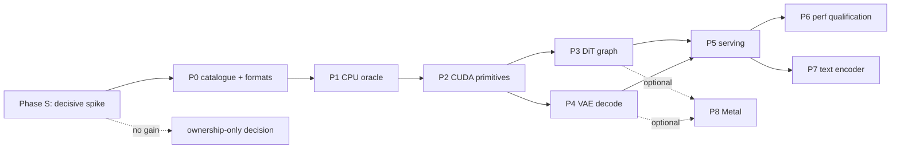

# Qwen-Image-2.1 native port — phase roadmap

[Documentation index](README.md) | [Repository README](../README.md) |
[Plan](qwen-image-2.1-plan.md) | [Recipe](qwen-image-2.1-recipe.md)

This is the working guideline for the port: the phases, what each must produce,
and the gate that ends it. The [plan](qwen-image-2.1-plan.md) holds the goal,
the porting strategy, the applicability of this tree's machinery, the
translation map and the decision; the [recipe](qwen-image-2.1-recipe.md) holds
the reference index, the model geometry and the op mapping. This document holds
the order of work.

Nothing here is implemented. Every phase below is a proposal; the status column
in section 7 is the live tracker.

## 1. Goal

**ds4-dfm-rs serves local text-to-image generation on its own engine and host:
one process, the tree's own C/CUDA kernels, a Rust host, no external runner, no
third-party runtime.**

The goal is capability and ownership, not speed. A port that reproduces
Qwen-Image-2.1 faithfully on this tree's stack and serves it through the API an
existing client already speaks is a success even if it is slower than the
`stable-diffusion.cpp` binary it replaces. Any speed claim must be measured
before it is made; none is assumed.

### Success criteria

| Id | Criterion | Proof |
| --- | --- | --- |
| G1 | A 1024x1024 image is generated from a prompt by a ds4 process, with no `sd.cpp` binary involved | a run log and the PNG, with the process list showing no `sd-server` |
| G2 | The result matches the reference: byte-identical initial noise, and the image inside the stated pixel band | the P1 numbers and the image comparison |
| G3 | An existing client works unchanged: the OpenAI images payload the current bridge accepts, including `aspect_ratio`, `resolution`, `num_inference_steps`, `seed`, `cfg_scale` | a served request from that payload returning a PNG |
| G4 | The engine reports a resolved plan (requested, effective, qualified) and refuses the autoregressive flags by name | `--check-config` output, and a test asserting each refusal |
| G5 | A recorded baseline: seconds per step, sampling split from VAE decode, with observed clocks | the P6 ledger |

### Non-goals for v1

- Not faster than `stable-diffusion.cpp`. Improving it is a later, measured
  question; the plan records why the usual caching levers do not apply.
- No image editing. The reference's edit path needs the Qwen3-VL vision tower;
  text-to-image does not.
- No Metal. The reference target is CUDA; `metal/` has no convolution and the
  inherited backend needs its own checks.
- No training, no LoRA, no adapter loading.
- No second serving contract: this engine does not get KV, banks, prefix reuse,
  snapshots or MTP, and it does not pretend to.

## 2. How each phase is run

These are the repository's rules applied to this project; they are not new.

- One unit is one branch off `main`, ending in a verified, committed state, with
  a PR. `main` stays production.
- Every unit carries a correctness proof and, when it touches execution, a
  speed proof. `tests/ds4_proof.py` records both for the GPU scenarios the
  harness covers.
- No claim without a run. Absence of failure is not proof of safety; a short run
  is not a sustained one.
- The reference is the authority. Where the [recipe](qwen-image-2.1-recipe.md)
  says *read at port time*, the detail is read from the pinned source and cited,
  never inferred.
- Numerics are settled before kernels. The CPU oracle is what the CUDA phases
  are measured against, not the other way round.
- New host code is Rust; new compute is C/CUDA. No C++ host layer.
- Anything unsupported is refused by name, never silently ignored.
- Model files and generated images are never committed; hashes and numbers are.

## 3. Phase map

Phase S runs first and stands alone: it needs no model, only kernels, and it is
the one thing that settles whether this port buys speed. P3 and P4 are
independent once P2 exists; they can be done in either order or in parallel by
two sessions. P5 needs both. P7 is deferred deliberately so the first deliverable
does not depend on porting a second model.

## 4. Phases

### S — The decisive spike (run this first)

Objective: know whether this engine can beat the reference on the axis that is
unmeasured, before committing to the port. Standalone: no model, no catalogue,
no pipeline.

Preconditions: none. This can run in parallel with P0 and P1.

Work items:

1. Masked non-causal attention at the DiT's real shape (about 4.3k tokens, 32
   heads of 128, no KV cache, per-segment masks), measured against the
   reference's own kernel on the same GPU.
2. Q6_K through a software-pipelined MMQ loop. That pipe in `cuda/mmq` is gated
   to other families' low-bit block types and never sees Q6_K (plan section 4),
   so this asks whether extending it to Q6_K pays at the DiT's shapes (M about
   4.3k, N 4096 and 12288, K 4096), against the stock loop.
3. Graph capture plus residency on a 12 GB card with the DiT's weight footprint
   resident: capture and replay overhead, and the per-step cost of staging
   weights into a fixed arena.

Gate: three numbers, each against the reference's own kernel on the same
hardware and clocks, with the same discipline the repository applies elsewhere —
a change that claims a gain must show it reproducibly and keep correctness.

Decision rule: if none of the three shows a useful gain, the performance case is
dead, the port proceeds only on ownership grounds, and this document says so
instead of implying otherwise. If one does, P6 inherits it as a starting
hypothesis rather than an open question.

**Gate result (2026-10-01, [report](qwen-image-2.1-phase-s.md)): no gain, all
three.** Measured on the reference's own kernels at the real shape (4096 image
tokens + 128 text, 4224-column GEMMs):

1. Attention: the deployed reference runs it unfused at 2390 ms/step (50.9% of
   the step — the two matmuls, the masked softmax and its separate score-scaling
   kernel) and the flag `--diffusion-fa` replaces all of that with one fused
   kernel at 544 ms/step (18.2%), taking the steady-state step from 4.855 s to
   2.945 s (1.65x). The port's own P2 route is to vendor that same upstream
   kernel, so it captures 0; the residual headroom (47% of the dense-FP16 rate)
   is only reachable by writing a better kernel and is worth at most 9.6% of a
   step.
2. Q6_K dense MMQ: the production kernel runs at 71.3-79.1 TFLOP/s against a
   cuBLAS dense-FP16 GEMM's 69.5-74.0 at the same shapes — at the tensor-core
   limit, with nothing for a pipelined K loop to close.
3. Capture, residency and staging: capture is bounded by the measured 5.5%
   host bubble (the direct GEMM block-pass figure was not stable across
   repeats, 3-55 ms/step), the offload arena costs 8.0% when the whole DiT is
   staged per step, and the DiT needs 7921 MiB of 11894 MiB, so residency is not
   the constraint the plan assumed.

The one unclaimed measured headroom is the 34.7% of the step spent in
elementwise glue. That is fusion work, which no phase below owns; if the port
proceeds for ownership reasons, it is the first thing to scope. P0-P6 must not
be started on a speed motive.

Traps: a short run is not a sustained one, and a micro-benchmark is not the
whole workload. Report both what was measured and what it does not prove.

### P0 — Catalogue, shape contract and artifact formats

Objective: the tree can identify and validate both artifacts without executing
them, and the format question is settled.

Preconditions: none.

Work items:

1. Engine kind. Add an image engine kind beside the text families in
   `ds4-core` (`crates/ds4-core/src/lib.rs` today exposes `Model` and
   `Session` with no engine-kind split). Do not touch `ModelFamily`; the AR
   contract does not apply.
2. Format decision for the VAE. The diffusion model ships as GGUF
   (`leejet/Qwen-Image-2.1-GGUF`), but the VAE ships as
   `qwen_image_2.1_vae_bf16.safetensors` and this tree reads GGUF only
   (`crates/ds4-core/src/gguf.rs` is the only loader; grep finds no
   safetensors reader). Choose one: a small Rust converter producing a GGUF with
   a pinned tensor layout, or a safetensors reader. Recommended: the converter,
   run once, with its output checksummed and the tool committed, because it keeps
   the runtime on one format.
3. DiT identification. Architecture key, tensor-name table, and the dims from
   the [recipe](qwen-image-2.1-recipe.md) section 3.1 (32 layers, hidden 4096,
   head 128, 32 heads, context 4096, in/out 64, axes 16/56/56).
4. VAE identification. Decoder block names and dims (dec_dim 144, z_dim 64,
   `dim_mult {1,2,4,8,8}`, temporal flags `{true,true,true,false}`), plus the
   64-value latent mean and standard deviation tables and the scale factor.
5. Bind plan. The host-owned name-to-tensor table and offsets, as the families
   have.
6. Plan and quote skeleton. Requested, effective and qualified, with refusals by
   name for `--ctx`, `--max-seqs`, `--prefix-reuse`, `--mtp-mode`,
   `--kv-disk-dir` and the other autoregressive flags.
7. Placement model. Three modules (text encoder, diffusion, VAE), each with an
   independent graph device and parameter tier (VRAM, host RAM, disk), reported
   per module in the resolved plan, and the measured constraints reproduced.
   This is a functional requirement, not a tuning detail. See the plan's
   appendix A.1.
8. Quantization. Q6_K is the single target artifact (229 of 297 tensors; the
   rest BF16, none F32), so the layout contract pins those tensor types.

Gate: a model-free layout test over both artifacts, and a `--check-config` run
that refuses each AR flag by name.

Evidence: the test names, artifact hashes, tensor counts, and the refusal list.

Traps: assuming the DiT is GGUF-loadable is right; assuming the VAE is is wrong.
Do not derive the VAE tensors from the DiT GGUF naming.

### P1 — CPU reference (the oracle)

Objective: a complete, slow, correct F32 pipeline that settles every numeric
question before any kernel exists.

Preconditions: P0.

Work items:

1. Philox RNG producing the initial noise.
2. Conditioning intake from reference dumps (the encoder is deferred to P7).
3. The DiT forward in full: `img_in`, the text projection with its zero-centered
   RMSNorm and GELU, the timestep embedding and `4*hidden` modulation with the
   prefix/image row split and `tanh` gates, 32 blocks of
   LayerNorm/modulate/segment-attention/LayerNorm/modulate/SiLU-gated-MLP, then
   `norm_out`, `proj_out` and the 1x1 unpatchify.
4. Positions, the 3-axis RoPE table, segments and masks.
5. The flow schedule, Euler and CFG.
6. The VAE decode in full: causal Conv3d, channel RMSNorm, 2x nearest upscale,
   residual and attention blocks, the head.
7. Latent statistics and the two conversions.
8. PNG output.

Gate: byte-identical initial noise and token ids against the reference; then
conditioning, one DiT evaluation and the final image within a stated tolerance,
recorded per stage.

Evidence: a dated report with the per-stage table, the artifact hashes and the
images.

Traps: the rope pairing convention; the `modulate` row split; the causal
temporal padding rule; and the output range map — the decoder already maps to
`[0,1]`, and applying it twice halves contrast. Two of these were bugs in a
previous port of this same model to another runtime, so they are known to be
real rather than hypothetical.

### P2 — CUDA primitives

Objective: every kernel the engine needs, each proven against the oracle in
isolation.

Preconditions: P1.

Work items: the kernel inventory in the [recipe](qwen-image-2.1-recipe.md)
section 7 — modulation, affine-free LayerNorm, 3-axis RoPE, segment attention,
gated MLP, timestep embedding, patch/unpatch, causal Conv3d, channel RMSNorm,
2x upscale, VAE attention, the conv block composite, and the Euler/CFG step.
Vendor first, write last: the convolution, upscale, pad, arange, group-norm and
masked-attention primitives all exist upstream in `ggml-cuda`, which this tree
already vendors 42 files from, so each one is a 1:1 copy plus a stub, not a
design. Only what has no upstream equivalent is written here.

Gate: per-kernel parity against the CPU oracle, all passing, in the style of
the existing per-kernel tests in `tests/`.

Evidence: the test targets and their output; a kernel-by-kernel table of max
absolute difference and relative RMS.

Traps: the conv3d weight layout is `[kW, kH, kT, IC*OC]` in F16 with F32
accumulation; the temporal pad is left-only; single group only.

### P3 — DiT on CUDA: residency, graph, capture

Objective: the 32-block DiT runs on the device, captured, and reproduces the
oracle.

Preconditions: P2.

Work items:

1. Residency: weights from the mmap to the device, with the fit quote.
2. The block graph and the full 32-block graph.
3. The offload path: weights in host RAM staged into a fixed VRAM arena, the
   DiT segmented into block groups with the next group prefetched, and the
   staging arena's addresses stable so a captured graph stays valid
   (appendix A.1 of the plan). Default off; this is the fallback for a layout
   that does not fit.
4. Capture, with the per-step inputs (timestep, sigma, noise) read from live
   substrate or the graph keyed by regime — never baked by value.
5. A kill switch and a fallback to the eager path, for both the graph and the
   offload mode.
6. A fit/plan report naming requested, effective and qualified limits, including
   the parameter tier per module and whether offload is active.

Gate: DiT velocity parity against the oracle with capture on, then an
end-to-end image using the oracle's VAE.

Traps: the stale-argument class the repository has already paid for three times
in the autoregressive case (`7c4b84d`, `a1cff19`, `8fb3c54`). In this graph the
timestep and sigma are exactly that class of quantity.

### P4 — VAE decode on CUDA

Objective: the decode path runs on the device and produces the reference image.

Preconditions: P2.

Work items: conv3d, RMSNorm, upscale, residual and attention blocks, the head;
placement (pinned, or host-resident with the graph on the device — see appendix
A.1 of the plan for the three-module model); tiling only if the untiled decode
does not fit, with the tile size as a configuration value and the seam
deviation quantified if tiling is used.

Gate: image parity against the oracle, plus decode seconds and peak VRAM.

Traps: the existing deployment's tiled decode differs from untiled by a
seam-localised amount; if tiling is needed, measure that deviation here rather
than inheriting the claim.

### P5 — Serving

Objective: an existing client gets an image without knowing the engine changed.

Preconditions: P3 and P4.

Work items:

1. Bridge symbols in `native/bridge/ds4_bridge.h`, following the existing shape:
   opaque handle, `int` return, `char *err, size_t errlen`, one `_free` per
   `_open`.
2. A Rust crate for the pipeline: config, sampler loop, conditioning input, PNG
   encoding, and the HTTP surface.
3. The routes the current client uses: `GET /v1/models`,
   `POST /v1/images/generations`, `GET /health`.
4. Request field mapping: `size` and the `aspect_ratio` + `resolution` pair
   resolved to a width and height divisible by 32, `n`, `num_inference_steps`,
   `seed`, `cfg_scale`, `response_format`.
5. The size ceiling as a property of the layout: a request above the
   configured maximum edge is refused with a named reason before it starts,
   because it would otherwise fail late and opaquely (appendix A.2).
6. Lifecycle: residency policy and an idle release, decided from a measurement
   rather than inherited, and never taken while a request is in flight.
7. Health and the resolved plan: the state the current `/health` exposes, plus
   the refusals in `--check-config` (appendix A.5).

Gate: a served request using the exact payload the existing client sends,
returning a valid PNG inside its timeout, with the process list showing no
`sd-server`.

Evidence: the served-run log with timings, the PNG, and the refusal test.

Traps: the client's timeout is a hard budget; a request that cannot finish
inside it must be refused with a named reason rather than started.

### P6 — Performance qualification

Objective: a baseline and a first optimization round, both measured.

Preconditions: P5.

Work items:

1. Establish the baseline: seconds per step, sampling split from VAE decode,
   observed clocks, peak VRAM, host RSS.
2. Run the repository's optimization loop: measure the whole workload, name the
   bottleneck, profile it, hypothesize, A/B with correctness, adopt or reject,
   then re-measure.
3. Candidate list, from the plan: graph on versus off; fused modulation and
   norm; attention kernel choice at the real shapes; MMQ tile choices for the
   DiT's weight shapes; VAE decode placement and fusion; and pinned versus
   offloaded residency, whose cost must be measured rather than assumed.

Gate: a ledger with the baseline, each A/B, the adoption decisions, and the
clocks.

### P7 — Text encoder (deferred)

Objective: remove the dependency on reference dumps for conditioning.

Preconditions: P5.

Work items: Qwen3-VL-8B-Instruct as its own contract — either a new family in
the text engine or an external encoder behind the same interface — with the
prompt template and the hidden-state slice point taken from the reference. Gate
on conditioning parity before it replaces the dumped path.

### P8 — Metal (optional)

Only if a Mac target appears. The kernel inventory repeats in `metal/*.metal`,
which has no convolution today. Not on the critical path.

## 5. Definition of done for v1

G1 through G5 all hold, on CUDA, with the evidence committed and the existing
bridge still working as the fallback. At that point the port is a capability the
tree owns; whether it replaces the current deployment is a separate decision
made on the P6 numbers.

## 6. Size

Estimates by content, not measurements — nothing has been built. They are
judgements about volume of code and evidence, not schedules.

The strategy is porting, not inventing, and that is what sets the size. Every
piece of model code is a 1:1 translation of a working reference file, and every
missing CUDA op has a 1:1 reference in the same `ggml-cuda` upstream this tree
already vendors from, with the stub pattern already proven. For calibration: the
Bonsai port, a whole model added to this tree, is 84 lines of primitives
(`cuda/qwen35_primitives.cuh`), 65 lines of Rust
(`crates/ds4-core/src/qwen35.rs`), and three commits touching them, with
everything else reused or vendored.

| Phase | New work | Size |
| --- | --- | --- |
| P0 | identification, two layout contracts, one format tool | small |
| P1 | a 1:1 translation of the DiT and VAE model files plus the sampler | medium |
| P2 | vendor the missing `ggml-cuda` ops and extend the stubs | medium |
| P3 | the DiT graph and residency over an existing graph layer | small |
| P4 | the VAE graph, the largest file to translate | medium |
| P5 | a serving surface over an existing serving pattern | medium |
| P6 | measurement and a first optimization round | medium |

The two uncertainties are P1, whose numerics can take more iterations than a
first pass suggests, and P4, where the volume of vendored ops is largest.
Neither is a research problem.

## 7. Tracker

| Phase | Status | Unit / branch | Gate result |
| --- | --- | --- | --- |
| S | **done — no gain** | `feat/image`, [phase-S report](qwen-image-2.1-phase-s.md) | three numbers measured; none capturable by the port (M1 0%, M2 0%, M3 <=5.5%) |
| P0 | not started | — | — |
| P1 | not started | — | — |
| P2 | not started | — | — |
| P3 | not started | — | — |
| P4 | not started | — | — |
| P5 | not started | — | — |
| P6 | not started | — | — |
| P7 | deferred | — | — |
| P8 | deferred | — | — |
