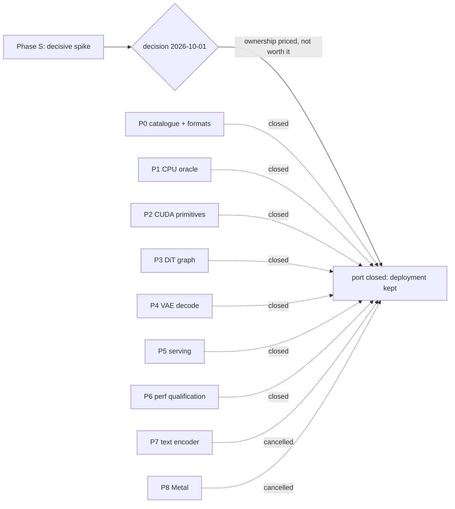

# Qwen-Image-2.1 native port — phase roadmap

[Documentation index](README.md) | [Repository README](../README.md) |
[Plan](qwen-image-2.1-plan.md) | [Recipe](qwen-image-2.1-recipe.md) |
[Phase S](qwen-image-2.1-phase-s.md) | [Decision](qwen-image-2.1-decision.md)

Status: **closed, 2026-10-01.** The port is stopped by the
[decision](qwen-image-2.1-decision.md): phase S measured no capturable
performance gain, and the decision unit priced the ownership motive and the one
unclaimed headroom the spike found, and found neither worth the six phases.
Nothing here is scheduled and nothing should be started from this document. The
[plan](qwen-image-2.1-plan.md) holds the goal, the porting strategy, the
applicability of this tree's machinery and the translation map; the
[recipe](qwen-image-2.1-recipe.md) holds the reference index, the model geometry
and the op mapping. The phase bodies below are retained as the record of what
was scoped and why each phase was closed.

## 1. Goal

**ds4-dfm-rs serves local text-to-image generation on its own engine and host:
one process, the tree's own C/CUDA kernels, a Rust host, no external runner, no
third-party runtime.**

The goal is capability and ownership, not speed. A port that reproduces
Qwen-Image-2.1 faithfully on this tree's stack and serves it through the API an
existing client already speaks is a success even if it is slower than the
`stable-diffusion.cpp` binary it replaces. Any speed claim must be measured
before it is made; none is assumed.

Motive status: the speed motive died with phase S; the ownership motive was
priced in the [decision](qwen-image-2.1-decision.md) section 3 and did not carry
the port either.

### Success criteria

| Id | Criterion | Proof | Status |
| --- | --- | --- | --- |
| G1 | A 1024x1024 image is generated from a prompt by a ds4 process, with no `sd.cpp` binary involved | a run log and the PNG, with the process list showing no `sd-server` | not pursued |
| G2 | The result matches the reference: byte-identical initial noise, and the image inside the stated pixel band | the P1 numbers and the image comparison | not pursued |
| G3 | An existing client works unchanged: the OpenAI images payload the current bridge accepts, including `aspect_ratio`, `resolution`, `num_inference_steps`, `seed`, `cfg_scale` | a served request from that payload returning a PNG | not pursued |
| G4 | The engine reports a resolved plan (requested, effective, qualified) and refuses the autoregressive flags by name | `--check-config` output, and a test asserting each refusal | not pursued |
| G5 | A recorded baseline: seconds per step, sampling split from VAE decode, with observed clocks | the P6 ledger | not pursued |

### Non-goals for v1

- Not faster than `stable-diffusion.cpp`. Improving it is a later, measured
  question; the plan records why the usual caching levers do not apply.
- No image editing. The reference's edit path needs the Qwen3-VL vision tower;
  text-to-image does not.
- No Metal. The reference target is CUDA; `metal/` has no convolution and the
  inherited backend needs its own checks.
- No training, no LoRA, no adapter loading.
- No second serving contract: this engine does not get KV, banks, prefix reuse,
  snapshots or MTP, and it does not pretend to.

## 2. How each phase was run

These are the repository's rules applied to this project; they are not new.

- One unit is one branch off `main`, ending in a verified, committed state, with
  a PR. `main` stays production.
- Every unit carries a correctness proof and, when it touches execution, a
  speed proof. `tests/ds4_proof.py` records both for the GPU scenarios the
  harness covers.
- No claim without a run. Absence of failure is not proof of safety; a short run
  is not a sustained one.
- The reference is the authority. Where the [recipe](qwen-image-2.1-recipe.md)
  says *read at port time*, the detail is read from the pinned source and cited,
  never inferred.
- Numerics are settled before kernels. The CPU oracle is what the CUDA phases
  are measured against, not the other way round.
- New host code is Rust; new compute is C/CUDA. No C++ host layer.
- Anything unsupported is refused by name, never silently ignored.
- Model files and generated images are never committed; hashes and numbers are.

## 3. Phase map

Phase S ran first and stood alone: it needed no model, only kernels, and it was
the one thing that could settle whether this port buys speed. It measured no
gain. The decision unit then priced the two remaining motives and closed every
phase below.

## 4. Phases

### S — The decisive spike (run first, done 2026-10-01)

Objective: know whether this engine can beat the reference on the axis that is
unmeasured, before committing to the port. Standalone: no model, no catalogue,
no pipeline.

Work items, all run against the reference's own kernels on this host at the real
shape (4096 image tokens + 128 text, 4224-column GEMMs):

1. Masked non-causal attention at the DiT's shape.
2. Q6_K through a software-pipelined MMQ loop, against the stock loop.
3. Graph capture, residency and the staging arena on a 12 GB card.

Gate result: **no gain, all three**
([report](qwen-image-2.1-phase-s.md), evidence index in its section 9).

1. Attention: the deployed reference runs it unfused at 2390 ms/step (50.9% of
   the step — two matmuls, the masked softmax and its separate score-scaling
   kernel) and `--diffusion-fa` replaces all of it with one fused kernel at
   544 ms/step (18.2%), taking the steady-state step from 4.855 s to 2.945 s
   (1.65x). The port's own P2 route is to vendor that same upstream kernel, so
   it captures 0; the residual headroom (47% of the dense-FP16 rate) is only
   reachable by writing a better kernel and is worth at most 9.6% of a step.
2. Q6_K dense MMQ: the production kernel runs at 71.3-79.1 TFLOP/s against a
   cuBLAS dense-FP16 GEMM's 69.5-74.0 at the same shapes — at the tensor-core
   limit, with nothing for a pipelined K loop to close.
3. Capture, residency and staging: capture is bounded by the measured 5.5% host
   bubble (the direct GEMM block-pass figure was not stable across repeats,
   3-55 ms/step), the offload arena costs 8.0% when the whole DiT is staged per
   step, and the DiT needs 7921 MiB of 11894 MiB, so residency is not the
   constraint the plan assumed.

The one unclaimed measured headroom is the 34.7% of the step spent in
elementwise glue. The [decision](qwen-image-2.1-decision.md) section 4 priced it
at 250-450 ms/step realistically capturable, below the 1910 ms/step that
`--diffusion-fa` returns for free, and dropped it as a motive.

Traps recorded: a short run is not a sustained one, and a micro-benchmark is not
the whole workload.

### P0-P6 — closed, motive withdrawn

None of these phases was started. Each entry states what it was, what its motive
was, and why it is closed; the work-item detail is in the previous revision of
this file and, for the phase order and gates, in the plan's section 11.

| Phase | Was | Motive | Closure |
| --- | --- | --- | --- |
| P0 | Catalogue, shape contract and artifact formats: engine kind, VAE format decision, DiT and VAE identification, bind plan, plan/quote and refusal skeleton, placement model, quantized-type pinning | make the tree able to identify and validate both artifacts without executing them | closed — serves only an engine that is not being built (decision section 5) |
| P1 | CPU reference: the F32 DiT forward, VAE decode, sampler, Philox, conditioning intake, PNG output | settle every numeric question before kernels exist | closed — an oracle with no consumer |
| P2 | CUDA primitives: vendor the missing `ggml-cuda` ops, extend the stubs, write what has no upstream equivalent | give the engine the kernels phase S had already priced as capturing nothing | closed — vendor-the-same-kernel captures 0 by construction (M1, M2) |
| P3 | DiT on CUDA: residency, the 32-block graph, capture, the offload path, kill switches | the device-side DiT | closed — its only measured win was capture's 5.5% host bubble |
| P4 | VAE decode on CUDA: conv3d, RMSNorm, upscale, residual and attention blocks, placement and tiling | decode on the device | closed — the port's gain here was never measured and no motive survived |
| P5 | Serving: bridge symbols, a Rust crate, routes, field mapping, lifecycle, refusals | one process for the client | closed — the deployment's two-layer supervision already covers the failure class (decision section 3) |
| P6 | Performance qualification: baseline, then the measured optimization loop | find the speed | closed — the spike and the decision both found the measured headroom below a free reference flag |

### P7-P8 — cancelled

P7 (Qwen3-VL-8B as its own text-encoder contract) and P8 (Metal) were deferred
behind P5 and are cancelled with it: neither has a consumer without the engine.

## 5. Definition of done

G1 through G5 would have held on CUDA, with the evidence committed and the
existing bridge still working as the fallback. That bar was never reached and is
no longer pursued; the [decision](qwen-image-2.1-decision.md) section 8 names
the triggers that would reopen it.

## 6. Size

Estimates by content, not measurements — nothing was built. They are judgements
about volume of code and evidence, not schedules, and they are what the decision
weighed against the ownership case.

The strategy is porting, not inventing, and that is what set the size. Every
piece of model code is a 1:1 translation of a working reference file, and every
missing CUDA op has a 1:1 reference in the same `ggml-cuda` upstream this tree
already vendors from, with the stub pattern already proven. For calibration: the
Bonsai port, a whole model added to this tree, is 84 lines of primitives
(`cuda/qwen35_primitives.cuh`), 65 lines of Rust
(`crates/ds4-core/src/qwen35.rs`), and three commits touching them, with
everything else reused or vendored.

| Phase | New work | Size |
| --- | --- | --- |
| P0 | identification, two layout contracts, one format tool | small |
| P1 | a 1:1 translation of the DiT and VAE model files plus the sampler | medium |
| P2 | vendor the missing `ggml-cuda` ops and extend the stubs | medium |
| P3 | the DiT graph and residency over an existing graph layer | small |
| P4 | the VAE graph, the largest file to translate | medium |
| P5 | a serving surface over an existing serving pattern | medium |
| P6 | measurement and a first optimization round | medium |

The two uncertainties were P1, whose numerics can take more iterations than a
first pass suggests, and P4, where the volume of vendored ops is largest.
Neither was a research problem, and neither is the reason the port is closed:
the measured benefit was.

## 7. Tracker

| Phase | Status | Unit / branch | Gate result |
| --- | --- | --- | --- |
| S | **done — no gain** | `feat/image`, [phase-S report](qwen-image-2.1-phase-s.md) | three numbers measured; none capturable by the port (M1 0%, M2 0%, M3 <=5.5%) |
| decision | **done — stop** | `feat/image`, [decision](qwen-image-2.1-decision.md) | ownership priced item by item, fusion priced at 250-450 ms/step, P0 boundary answered |
| P0 | closed — motive withdrawn | — | — |
| P1 | closed — motive withdrawn | — | — |
| P2 | closed — motive withdrawn | — | — |
| P3 | closed — motive withdrawn | — | — |
| P4 | closed — motive withdrawn | — | — |
| P5 | closed — motive withdrawn | — | — |
| P6 | closed — motive withdrawn | — | — |
| P7 | cancelled | — | — |
| P8 | cancelled | — | — |

Reopen triggers and the conditions that would not reopen the port are in the
[decision](qwen-image-2.1-decision.md) section 8.
